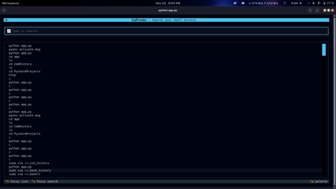
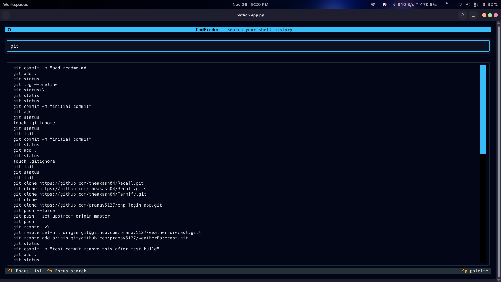

# CmdFinder

**CmdFinder** is a terminal-based user interface (TUI) tool that allows you to fuzzy search, navigate, and execute commands from your local shell history. Built with [Textual](https://textual.textualize.io/) and Python.

<p align="center">
  
</p>
<p align="center">
  
</p>

## Features

* **Fuzzy Search:** Instantly find commands even if you don't remember the exact syntax (powered by `rapidfuzz`).
* **Shell Support:** Automatically detects and loads history from Zsh (`~/.zsh_history`) and Bash (`~/.bash_history`).
* **Instant Execution:** Select a command to run it immediately in your active shell.
* **Vim-like Navigation:** Navigate results using `j` and `k`.
* **Metadata:** Toggle timestamp views to see when commands were run.

## Installation

### Prerequisites
* Python 3.10+

### Setup

1.  **Clone the repository:**
    ```bash
    git clone https://github.com/pranav5127/CmdFinder.git
    cd cmdfinder
    ```

2.  **Create a virtual environment (optional but recommended):**
    ```bash
    python -m venv .venv
    source .venv/bin/activate
    ```

3.  **Install dependencies:**
    ```bash
    pip install -r requirements.txt 
    ```

## Usage

To start the application, run:

```bash
python app/app.py
